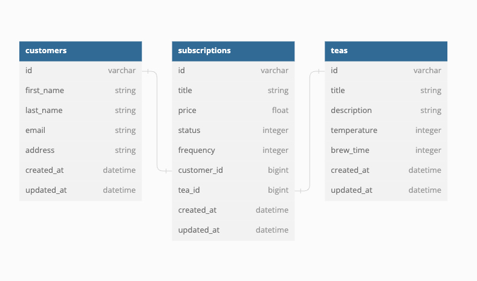
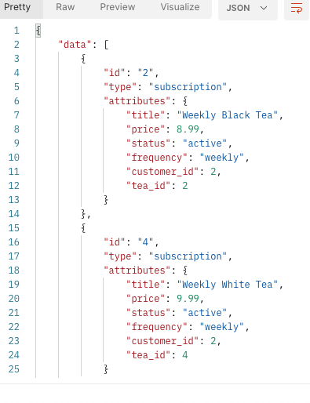
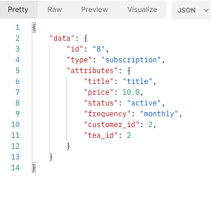
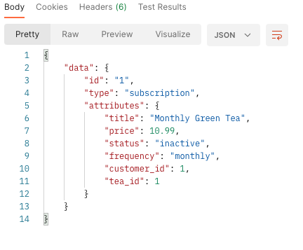

# Tea Subscription Service

Welcome to the Tea Subscription Service API! This API provides a convenient and seamless way for customers to subscribe to tea subscriptions, manage their subscriptions, and enjoy a delightful tea experience delivered right to their doorstep. Developed using Ruby on Rails, this API ensures a smooth and efficient flow of data, making it easy for Frontend Developers to integrate it into their applications.

### Built With

[](https://rubyonrails.org/)
[](https://www.postgresql.org/)
[](https://github.com/puma/puma)
[](https://github.com/teamcapybara/capybara)
[](https://github.com/thoughtbot/shoulda-matchers)
[](https://rspec.info/)

## Getting Started
<!-- can change this later or add more detail -->
### Prerequisites

* Ruby
  ```sh
  Ruby 3.1.1
  ```

* Rails
  ```sh
  Rails 7.0.4.3
  ```
* [PostgreSQL](https://www.postgresql.org/download/)

<br />

### Installation

_Follow the steps below to install and set up this app._

1. Clone this Repository
   ```sh
   git clone git@github.com:kassandraleyba/tea_subscription.git
   ```
2. In your terminal, run the following commands;
    ```sh
    bundle install
    rails db:{drop,create,migrate,seed}
    ```

    <p align="right">(<a href="#readme-top">back to top</a>)</p>

<br />

## Schema

<br />

   


<p align="right">(<a href="#readme-top">back to top</a>)</p>

<br />

# Endpoints

- GET localhost:3000/api/v1/customers/2/subscriptions/



<br>

- POST localhost:3000/api/v1/customers/2/subscriptions/



<br>

- PATCH localhost:3000/api/v1/customers/1/subscriptions/1



<p align="right">(<a href="#readme-top">back to top</a>)</p>

<br />